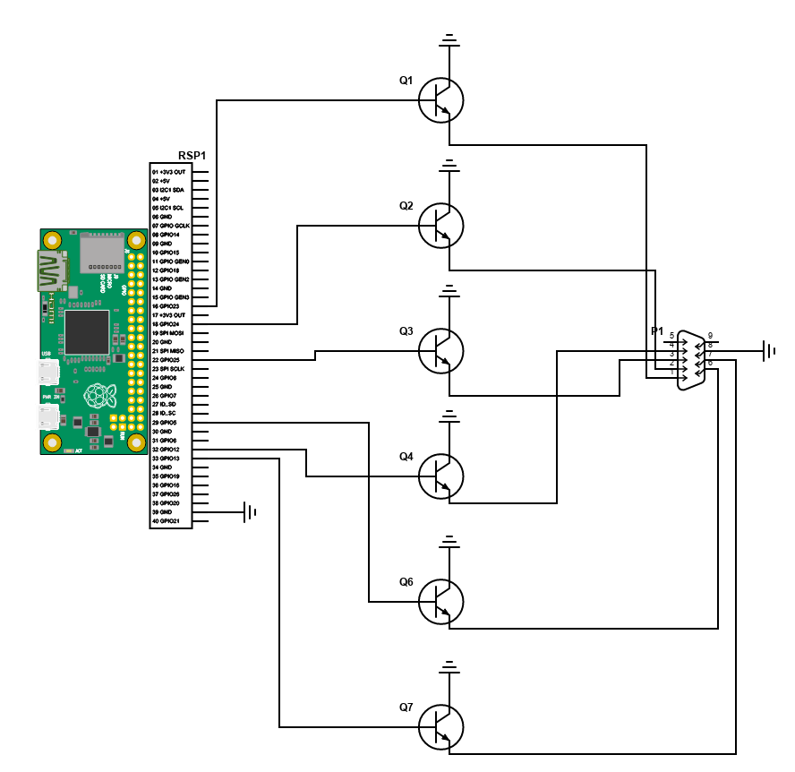

# GAMEPADtoMSX
## by Ethan Moody
(Gamepad.py library by [PiBorg](https://github.com/PiBorg))

# Getting Started

To start reading from your controller of choice, simply execute `python SOMECONtoMSX.py`.

# Making your own
If you don't see your controller listed, execute `python Controllers.py`, and make note of each button value and axis value in separate lists. Buttons and axes are enumerated over in separate objects.

Make a copy of one of the `SOMECONtoMSX.py` programs, and modify the `CustomController` class so that your buttons are labeled properly. ex:

```python
class CustomGamepad(Gamepad.Gamepad):
    def __init__(self, joystickNumber = 0):
        Gamepad.Gamepad.__init__(self, joystickNumber)
        self.axisNames = {
            0: 'LEFT-X',
            1: 'LEFT-Y'
        }
        self.buttonNames = {
            1:  'A',
            2:  'B'
        }
        self._setupReverseMaps()
```

Technically the buttons on the MSX are labeled I and II, but I figured A and B would be more readable. A, of course, maps to button I and B to II. You can rename them if you wish, but you'll need to make sure the logic in the main loop below is looking for the right button and/or axis events.

# Schematic



I'm using a Raspberry Pi Zero as an example here, but you could easily use any SBC that has user programmable GPIO pins.
